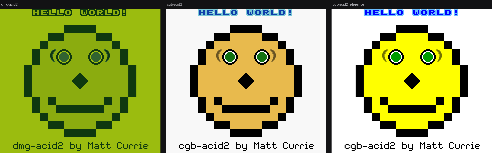

# Cartridge

A Game Boy and Game Boy Color emulator written in Swift, for iPhone, iPad and Mac.

Cycle-accurate CPU, scanline PPU, four-channel sound, and a library that syncs.
It passes every accuracy suite it's been pointed at, including a pixel-exact
match against the reference renders of both `dmg-acid2` and `cgb-acid2`.



*Left to right: `dmg-acid2`, this emulator's `cgb-acid2`, and Matt Currie's
published reference. The colours differ because this applies the colour
correction a real Game Boy Color screen implied and the reference doesn't;
structurally, **0 of 23,040 pixels differ**.*

---

## Accuracy

Emulators are easy to write and hard to write *correctly*. "It boots a game I
own" is the weakest possible standard, so this is measured against the suites
the community built to make correctness an objective question.

| Suite | What it checks | Result |
| --- | --- | --- |
| [SingleStepTests SM83](https://github.com/SingleStepTests/sm83) | Every instruction, one at a time, against a reference implementation | **500 opcodes, 500,000 cases** |
| Blargg `cpu_instrs` | Instruction behaviour on real hardware | **11 / 11** |
| Blargg `instr_timing` | Every instruction's cycle count | **Passed** |
| Blargg `mem_timing` | *When inside* an instruction each access lands | **3 / 3** |
| Blargg `halt_bug` | The `HALT` program-counter quirk | **Passed** |
| `dmg-acid2` | Every monochrome PPU edge case in one frame | **Pixel-exact** |
| `cgb-acid2` | Colour banking, attributes, palettes, priority | **Pixel-exact** |
| Blargg `dmg_sound` | Sound hardware minutiae | 3 / 12 |

The whole suite runs in about seventeen seconds. `dmg_sound` is the honest gap —
what's left in it is wave RAM access during playback and length counters across
power transitions, none of which affects ordinary play, but it isn't finished.

The test ROMs aren't committed. `scripts/fetch-roms.sh` and
`scripts/fetch-tests.sh` download them, so the repository holds no binaries.

## What it does

- **Game Boy and Game Boy Color.** Two VRAM banks, per-tile attributes, eight
  background and eight object palettes, banked work RAM, H-blank VRAM transfer,
  double-speed mode.
- **Sound.** Two square channels, the wave channel, and the noise channel, mixed
  through the hardware's own panning and volume, output through a lock-free ring
  buffer to `AVAudioEngine`.
- **Mappers.** MBC1, 2, 3 and 5 plus unmapped cartridges — effectively the whole
  library. MBC3's real-time clock keeps running while the app is closed, because
  it's an offset from wall time rather than a counter.
- **Saves.** Battery saves in the standard `.sav` format, three save-state slots,
  and an automatic state so leaving a game costs nothing.
- **A library**, with artwork you choose or the last frame of your last session.
- **Themes.** Five shells and five button sets, chosen independently.
- **iCloud**, so games and saves follow you between devices.
- Touch controls with a thumbstick, hardware keyboard, on-screen clip capture to
  GIF, LCD ghosting, and monochrome palettes.

## How it's built

```
EmulatorKit/     The shell's contract with a console — screen, buttons, frames
GameBoyKit/      The console: CPU, PPU, APU, timer, mappers, memory map
Cartridge/       SwiftUI for iOS and macOS
GameBoyKitTests/ The accuracy suites
```

`EmulatedSystem` exists so that rendering, input, audio, save states and file
handling get written once. A second core is a second conformance rather than a
second application.

Two decisions did most of the work:

**The CPU knows nothing but a bus.** It can't see cartridges, video memory or
hardware registers — only `read` and `write`. That's what lets the entire
instruction set be verified against a flat 64 KB array with no console attached.

**The opcode map is decoded structurally, not as 500 cases.** An opcode splits
into `xxyyyzzz`, where `x` picks a block and `y`/`z` select registers,
conditions or operations. Every `LD r,r'`, every ALU operation, and the whole
`CB` page fall out of that as a few lines each.

## Engineering notes

The bugs worth writing down, because each one changed how the thing was built.

**`mem_timing` failed, and the fix was architectural.** The bus advanced the
timer and PPU *after* each instruction. That gets every cycle count right and
still fails, because the test asks when *inside* an instruction each read lands.
Now every bus access ticks the machine as it happens. It costs ~40% throughput
and buys a class of correctness unreachable otherwise.

**A sampled test suite reported the same green as a complete one.** A wrong `DAA`
shipped past 500 passing opcodes. Measured afterwards: the bug failed 1% of
`DAA`'s reference cases, and the suite was sampling 25 of 1,000 — so it missed it
**78% of the time**. Blargg caught it instead. The full suite runs in eight
seconds, which is a poor reason to gamble.

**Save states were 847 KB and took 236 ms**, which is unusable for anything that
writes them continuously. The cause was the audio channel's pending sample buffer
being serialised. Excluding it and the framebuffers, and switching from JSON to a
compressed binary property list, took them to **6 KB and 1.7 ms**. A test asserts
they stay under 64 KB, because for this that number is a feature.

**A profile said the renderer got cheaper. It had stopped drawing.** Presentation
went from 137% of a core to 30% across three changes — a layer-backed view instead
of `Image`, sRGB instead of DeviceRGB, and whole-module optimisation for Debug
(`-O` alone doesn't inline across CPU → bus → PPU, which is every hot call there
is). But one intermediate state had a lower CPU number *because the picture was
missing*. A performance number is not a correctness check.

**An iOS app with no launch screen runs letterboxed.** Content sat centred in a
band of black, and it presents exactly as a SwiftUI layout bug — three layout
fixes changed nothing. The cause was `settings_iOS:`, which is not an XcodeGen
key and had been silently ignored since the first build. Measuring the container
found a bare `Color.blue` filling 522 of 874 points, which no view could explain.

**A target that compiles is not a target that works.** Every round built the Mac
app and ran its tests. Neither noticed that moving the player out of the
navigation stack had removed the only way to leave a game.

## Running it

Requires Xcode 16+ and [XcodeGen](https://github.com/yonaskolb/XcodeGen).

```sh
xcodegen generate
./scripts/fetch-tests.sh      # SM83 suite, ~145 MB
./scripts/fetch-roms.sh       # hardware test ROMs
xcodebuild test -scheme Cartridge_macOS -destination 'platform=macOS'
```

Open the project and run `Cartridge_iOS` or `Cartridge_macOS`. Add a ROM through
the library — the app copies it in, so the original can move or be deleted.

No ROMs are included, and none ever will be.

### iCloud

The code is complete but the capability isn't enabled, because registering a
container is a developer-portal change. To turn it on: add the **iCloud**
capability with **iCloud Documents** and the container
`iCloud.me.jacobsilva.Cartridge` to both app targets, then uncomment
`CODE_SIGN_ENTITLEMENTS` in `project.yml`. Without it the app runs on local
storage and switches over as soon as the capability exists.

## What's missing

- The rest of `dmg_sound`.
- Game controller support.
- An Apple TV target, which the library was restructured to make possible.
- Game Boy Advance, which would be a second core rather than an extension —
  real hardware ran Game Boy games on a separate CPU, so supporting both
  libraries genuinely means two.
